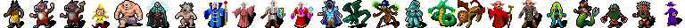
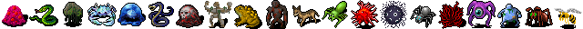
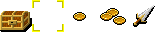
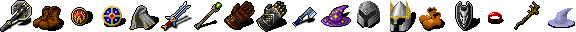
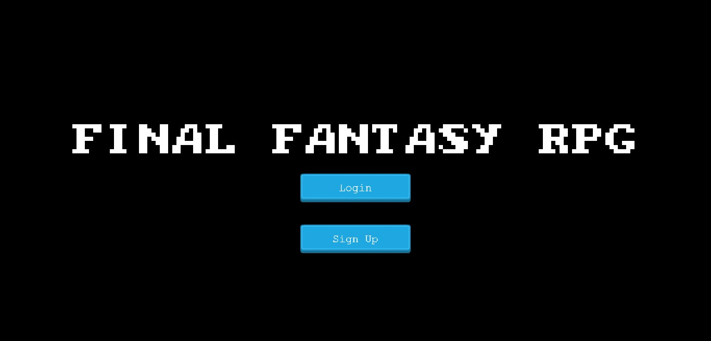
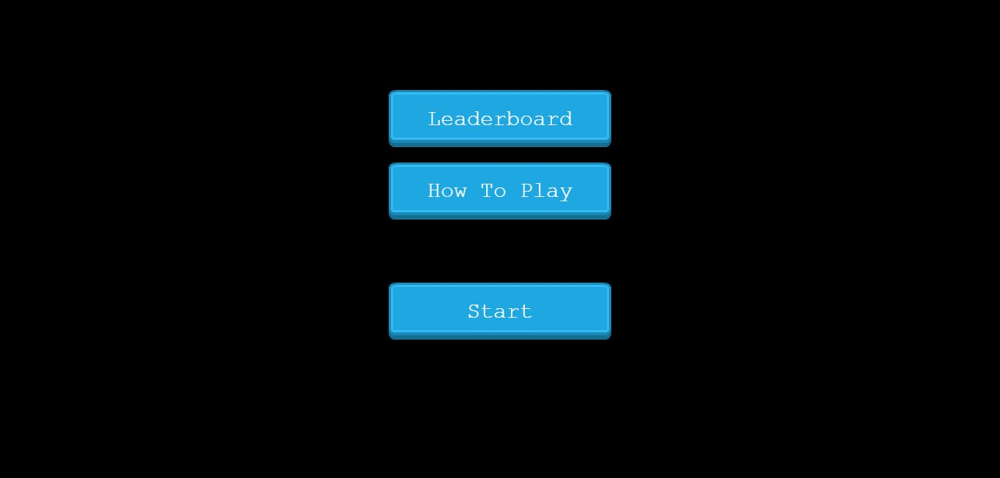
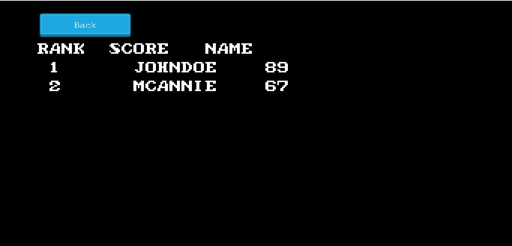
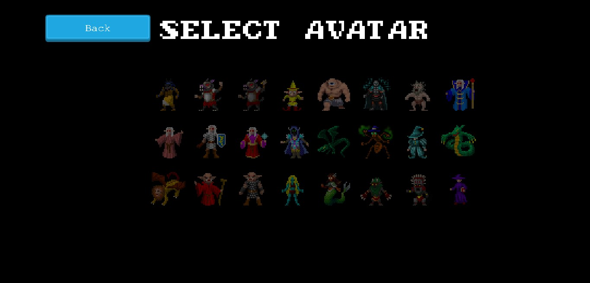
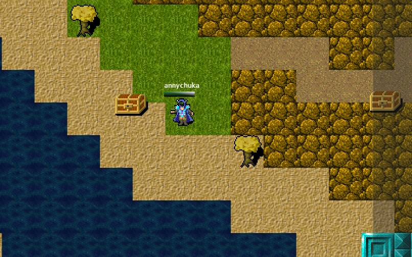

# JavaScript Capstone Project: RPG Game (Final Fantasy)

This is Microverse's final project for the Javascript section of the curriculum.

In this project I implemented an online multi-player RPG game using [Phaser 3](http://phaser.io/tutorials), an open-source framework for Canvas and WebGL powered browser games.

## Table of Contents

  - [About](#about)
  - [Code Logic/Flow Overview](#code-overview)
  - [The game](#the-game)
    - [How to play](#how-to-play)
  - [Installation](#installation)
  - [Design](#design)
    - [Game Characters/Features](#design-details)
    - [Scenes](#scenes)
  - [Technologies used](#technologies-used)
  - [Contact](#contact)
  - [Acknowledgements](#acknowledgements)

## About

This is a game app built with JavaScript which I named after the game - Final Fantasy. The objective of this project was to design and build a Role Playing Game (RPG) using Phaser and Javascript among other technologies and a scoring system. And as well as using this tutorial <a href="https://gamedevacademy.org/how-to-create-a-turn-based-rpg-game-in-phaser-3-part-1/">GameDev Academy</a> to point me in the right direction as to how to go about it.

In the light of that, I added extra features to the game to make it very interactive and fun to play. I implemented an authentication system and created a multiple playing real time features where users can log in and compete with others players in real time. And the fun part is that you can also chat with other players in real time too. In the game, players have the ability to gain scores, destroy enemies and fight with other players and get score levels saved to a leaderboard. 

Link to a [live-version](https://final-fantasy-10.herokuapp.com/).

Repository: https://github.com/adaorachi/RPG-Game

## Code Logic/Flow Overview

In this project, I built the client side code and the server side code. This can be viewed from this repo branch - [deployed-game](https://github.com/adaorachi/RPG-Game/tree/deployed-game). The client folder contains code that is served through the server side code.
In the server folder, it contains an Express.js based application. I built a simple and custom server for user authentication using node.js, Express and MongoDB.
- Express.js: A node.js application used to send and get post request and additional endpoints and where a user can log in and out from the system and also reset password.
- MongoDB: Database to store users information/credentials after successful validation.
- MongoDB Atlas: A cloud-based hosting service for hosting the MongoDB database instance.

In addition to these, I also implemented a bi-directional communicaation between the client and server using socket.io. Socket.io was used to listen for all game object events in real time and send it back to the server. This was also used to implement the chatting system.

- Socket.IO: An engine that enables real-time, bi-directional and event-based communication.

Lastly, I used Heroku, a cloud-based service to deploy the client side code of the game app for visualization and physical implementation.

## The game

In this never-ending game, you will have the ability to choose your avatar character after successful credentials validation into the game. And you will be spawned at a random location in the Fantasy forest at every login. 

In the Fantasy forest, you will have to take up chests to gain gold. Each chest has different gold values attached to it. You will also have to gain inventory items too. But be careful of the items you pick up, some of them reduces your strength and makes you susceptible to attack while others makes you immuned to attack and stronger. But the good part is that you can always remove inventory items if you do not want them. 

 You will also be hunted by a handful of monsters which you will have to destroy to gain life. Some monsters are more powerful than the others and they will get to destroy you if your defense is low or you have low life span.

Remember, this is a never-ending game, so there are no round rules. Once you are out of life, you'll get respawned at a random location in the forest with full life. Your coins value is also deducted which accounts for your full life.

You can also view the leaderboard at the beginning of the game with players score stats.

### How to play
  - If you have not signed up yet, you can do so and log in with the right credentials to start the game.
  - Navigate to the 'Select Avatar' Scene and click on a avatar to select a character of your choice.
  - Next, you will be taken to the Game Scene. Use the keyboard buttons  to move player around.
  - Press the space bar key  to attack enemy/monster. 
  - Pick up gold chest to gain its monetary equivalent in coins.
  - Pick up inventory item to strength defense or otherwise.
  - Click on the instruction icon at the bottom left of the screen to view your inventory items. You can choose to remove any item from the modal popup.
  - Click on your player to view your inventory items and perform the same action as stated in the previous rule.
  - Click on other players who are online to view their inventory stats.
  - Hover over the dialogue box overlay at the right to show chat box where you can chat with other online players.
  - Once you are out of life, you get respawned with full life and continue playing.

You can play the game online clicking [here](https://final-fantasy-10.herokuapp.com/) or locally following the installation steps stated in the sections below:

## Installation

NOTE: To install the full features of this game as seen in the online version, you will have to use the - [deployed-game](https://github.com/adaorachi/RPG-Game/tree/deployed-game) repo branch, where the client and server codes are contained. It is also important to note that the application will need the following prequisite installations to be done locally on PC - [MongoDB](https://docs.mongodb.com/manual/installation/) and  - [Docker](https://www.docker.com/) to containerize the game app. 
The applications above are used in order to serve the game authentication system properly.

Docker: A tool designed to create, deploy, and run applications by using containers. Containers allow a developer to package up an application with all of the parts it needs, such as libraries and other dependencies, and deploy it as one package.

However, if you wish to install the game application with less features, you will have to use this current repo branch - [phaser-RPG](https://github.com/adaorachi/RPG-Game/tree/phaser-RPG). Features like user authentication, chat system and inventories are removed as these features uses the user authenticaiton to be implemented.

See the instruction below for both installations:

#### clone the repo by typing 
~~~
git clone https://github.com/adaorachi/RPG-Game
~~~

#### navigate to the folder by typing
~~~
cd RPG-Game
~~~

#### Here, if you wish to get the full features, navigate to deployed-game repo branch and install dependencies
~~~
git checkout deployed-game
~~~

~~~
npm install
~~~

##### Otherwise, navigate to the phaser-RPG repo branch and cd into client folder to install dependencies
~~~
git checkout phaser-RPG
~~~

~~~
cd client
~~~

~~~
npm install
~~~

#### start server at port :8000 to view client side game
~~~
npm run start
~~~

#### open a browser tab and navigate to localhost to view game app

~~~
localhost://8000
~~~

### If you had gone ahead to install the full app features, continue from here. Otherwise, the app is now fully installed. 

#### Before working down the following installation, ensure that the Docker app and MongoDB app are running locally on PC.

#### Next, cd out of client folder and into the server folder to install dependencies
~~~
cd ../server
~~~

~~~
npm install
~~~

#### run nodemon to start the auth server at port :3000
~~~
npm run nodemon
~~~

#### open a browser tab and navigate to localhost to view game app

~~~
localhost://8000
~~~

You will have a live update of your score as you play. Enjoy the game!

## Design 
- The Game starts with a authentication validation. After successful login, it shows the option screen with options to view the LeaderBoard, How-To-play and Start game.
- The LeaderBoard option shows the LeaderBaord scene that displays players' scores from the highest rank.
- The About option shows the About scene that displays a list of rules and how to play the game.
- The Start option takes you to the Avatar Selection Scene where you can choose an character avatar. Once you select an avatar by clicking on it, you are taken to the Game Scene. 
- In the Game scene, you can move and navigate the player around with the arrow keys and fight an enemy or player with the space-bar key. Once you attack an enemy, it automatically attacks you back and your health bar gradually drains.
- If you successfully destroy an enemy, your earn points and your health bar get replenished by random values based on the strength level of the enemy.
- If an enemy destroys you, you get respawned at a random location with full bar and some points deducted to gain your full bar and you can continue playing.
- In the Game scene, you can pick up gold chest to earn points and inventory items dor attack or defense values
- In the Game scene, you can view your stats by clicking on the character avatar or view other players stats by clicking on their avatar.
- In the Game scene, you can also chat with other players.

### Game Characters/Features

#### Players Characters

The screenshot below is a display and formation of the player-character avatars which you have the ability to choose any. Use a player character to seek for enemies in the forest and take up gold chest and inventory items. 

A character has a full health bar of **150 hp*** and possesses a sword for attack. Damages can be done on a character's life when it fights an enemy or other players. Once a player-character is out of life, it gets respawned at a random location with full life
.  

#### Enemies Characters

The screenshot below is a display and formation of the enemies-character avatars. These characters are AI programmed to move within a 8 by 8 square tile. An enemy only fights back when it is attacked by a player character. This is noticed by the life drainage of the player character. Enemies are spawned at random locations of the forest. Once an enemy-character is out of life, it gets respawned at a random location with full life but with a different avatar. They keep coming back for the player.  

#### Players' Items

- Chest: This is golden box container. Once a player pick them, it converts to a monetary equivalent in coins. The amount is stored up as a player's score for the leaderboard stats.
- Weapon: The player's sword used for combat and defense.
- Coins: To identify player's picked-up golds for player's score.
  

#### Inventory items

These items have special bonuses tied to them and are rarely spawned at random location of the forest. Some of them have positive effect, and others have negative effect. When picked up by a player character, it makes them have attack and defense values. The ones with negative effect makes a player prone to attack while the ones with positive effect strengths a players defense against enemies.  

#### Inventory Dialogue Box

This is modal popup when a user clicks on his/her character. It displays players stats as well as the golds picked up and it also shows the inventory item that a player currently holds and the bonuses these items have. A player can drop an item by removing them in cases where an item have a negative effect. A player can also click on another player to see his/her stats.  

#### Chat Dialogue Box

The chat dialogue box is clearly visible when a player hovers on the right side of the screen. It has an input box where players can chat with each other in real time.  

### Scenes

##### Login scene

##### Option scene

##### LeaderBoard scene

##### Avatar Selection scene

##### Game scene

## Technologies used

* JavaScript
* [Phaser 3](https://phaser.io/phaser3)
* HTML
* CSS
* node
* Webpack
* Eslint
* Babel
* Jest - For testing purpose.
* Github
* [Socket.IO](https://socket.io/) - For bi-directional communication and chatting system
* [MongoDB](https://www.mongodb.com/) - For hosting users authentication credentials
* [Express.js](https://expressjs.com/) - For custom server system.
* [Heroku](https://heroku.com/) - For the deployment
* [Leaderboard API service](https://www.notion.so/Leaderboard-API-service-24c0c3c116974ac49488d4eb0267ade3) - For storing and retrieving leaderboard stats

## Authors

 MaryAnn Chukwuka
 - Github: [@adaorachi](https://github.com/adaorachi)
 - Linkedin: [MaryAnn Chukwuka](https://www.linkedin.com/in/adaorachi/) 
 

## 🤝 Contributing

Contributions, issues and feature requests are welcome!

Feel free to check the [issues page](https://github.com/adaorachi/RPG-Game/issues).

## Show your support

Give a ⭐️ if you like this project!

## Acknowledgements

* [Microverse](https://www.microverse.org/)
* [Phaser](https://phaser.io/)
* [OpenGameArt](https://opengameart.org/)
* [RPG Tutorial](https://phasertutorials.com/how-to-create-a-phaser-3-mmorpg-part-1/)

- Assets by: 
  * [craftpix.net](https://craftpix.net/)
  * [ashamaluevmusic](https://soundcloud.com/ashamaluevmusic/sets/music-for-gaming-videos)
  * [Arcade Bitmap Text](https://www.1001fonts.com/arcade+bitmap-fonts.html)

[contributors-shield]: https://img.shields.io/badge/Contributors-2-%2300ff00
[contributors-url]: https://github.com/adaorachi/RPG-Game/graphs/contributors
[issues-shield]: https://img.shields.io/badge/issues-0-%2300ff00
[issues-url]: https://github.com/adaorachi/RPG-Game/issues/